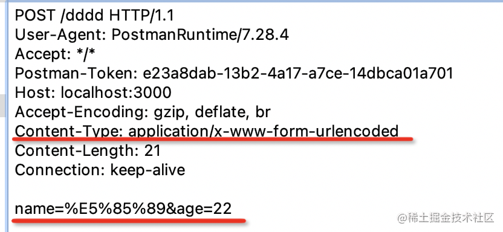
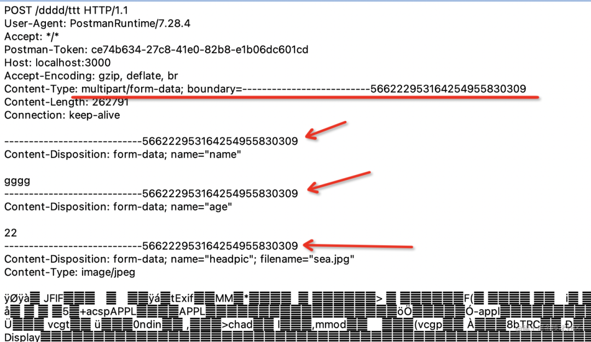
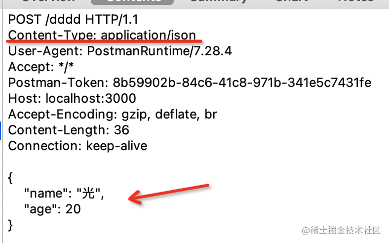

# 网络请求发送数据的几种方式

通过 http/https 向服务端传递数据的方式，基本可以分为以下五种：

## 1. GET - url param

例如：

    https://example.com/user/23

这里23是地址https://example.com/user的参数。

## 2. GET - url query

例如：

    https://example.com/user?id=23

注意，这种方式传递的数据要使用 encodeURLComponent 格式。在Node.js中可以用下面方式来进行编码：

```js
const queryString = require('query-string');

queryString.stringify({
  name: '光',
  age: 20
});
//?name=%E5%85%89&age=20
```

## 3. POST - form-urlencoded

内容类型：

    application/x-www-form-urlencoded

例如：



因为也是 query 字符串，所以也要用 encodeURIComponent 格式。

其实这种设计也很容易理解，get 是把数据拼成 query 字符串放在 url 后面，于是设计表单的 post 提交方式的时候就直接用相同的方式把数据放在了 body 里。

urlencoded 方式需要对内容进行编码，如果传递大量的数据，比如上传文件的时候就不是很合适了，因为文件内容编码一遍的话太慢了，这时候就可以用 form-data。


## 4. POST - form data

内容类型：

    multipart/form-data

form data 不再是通过 & 分隔数据，而是用 --------- + 一串字符串做为分隔符（boundary），不再需要对内容进行 urlencoded 编码。



## 5. POST - json

内容类型：

    application/json

form-urlencoded 需要对内容进行编码，而 form data 则需要加很长的 boundary，两种方式都有一些缺点。如果只是传输 json 数据的话，不需要用这两种方式，直接用json形式传送数据。



常用的传递数据方式就以上五种，当然，也可以指定别的内容类型，比如 application/xml、text/plain 等，但一般不常用。
